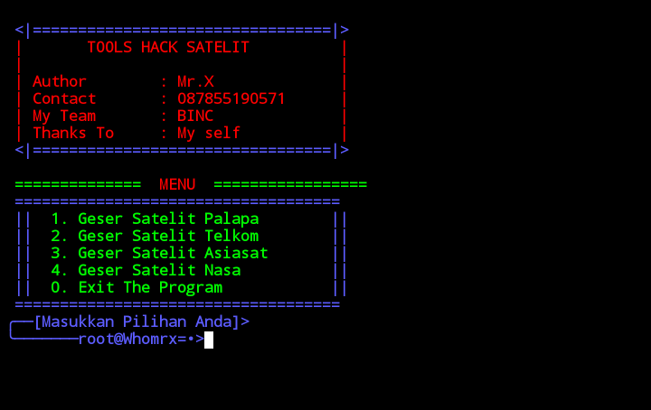

# Hack satelit


Hack satellites easily

## Instalations
```
$ pkg update && pkg upgrade
$ pkg install git
$ git clone https://github.com/Whomrx666/Hack-satelit
$ cd Hack-satelit
$ sh Hack-satelit.sh

```

## Instructions
- **Satelit palapa**: Palapa is the name of a satellite owned by Indonesia since 1976
- **Satelit telkom**: 26 July 2018 – Telkom Satellite owned by PT Telkom Indonesia (Persero) Tbk
- **Satelit asiasat**: Asia's premier commercial satellite since our founding in 1988
- **Satelit nasa**: NASA was founded in 1958, replacing the National Advisory Committee for Aeronautics (NACA)
### Original Author
<a href="https://github.com/Whomrx666"></a>

Follow me: [Whatsapp](https://wa.me/6287855190571),[Youtube](https://youtube.com/@whomrx666),[Tiktok](https://www.tiktok.com/@whomr.x),[Telegram](https://www.tiktok.com/@whomr.x),[Telegram](https://t.me/@Whomr_X),&[Website](https://whomrxhackers.blogspot.com/)
